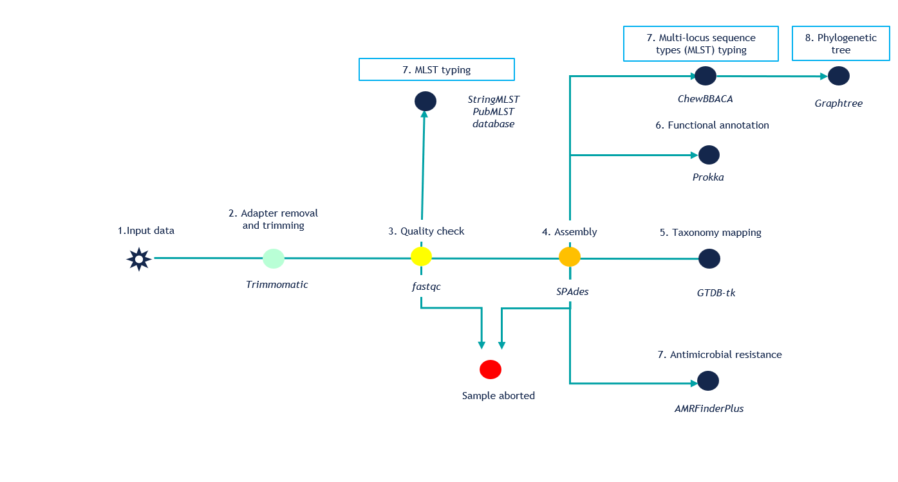

# Introduction
WGS_analysis pipeline is a bioinformatics pipeline based on Bactopia for complete analysis of bacterial genomes. 


## Pipeline summary



This pipeline is a bioinformatics workflow for whole-genome sequencing (WGS) analysis. The WGS_analysis pipeline is built with [Nextflow](https://www.nextflow.io/) It takes raw sequencing reads as input and performs read preprocessing, quality control, genome assembly, taxonomic assignment, functional annotation, antimicrobial resistance detection, MLST typing, cg/wgMLST analysis, and phylogenetic tree construction.

The workflow is designed to provide a reproducible end-to-end analysis starting from raw FASTQ files and producing standardised outputs for downstream genomic epidemiology, pathogen surveillance, and comparative genomics.

The pipeline performs the following steps:

1. **Input data**
   - Accepts raw sequencing reads, typically paired-end FASTQ files.

2. **Adapter removal and read trimming**
   - Removes sequencing adapters and low-quality bases using [Trimmomatic](http://www.usadellab.org/cms/?page=trimmomatic).

3. **Read quality control**
   - Performs quality assessment of raw and/or trimmed reads using [FastQC](https://www.bioinformatics.babraham.ac.uk/projects/fastqc/).
   - Samples that do not pass defined quality-control thresholds can be flagged or aborted before downstream analysis.

4. **Genome assembly**
   - Assembles quality-filtered reads into draft genome assemblies using [SPAdes](https://github.com/ablab/spades).
   - Assembly quality thresholds can be used to stop low-quality samples before further analysis.

5. **Taxonomy mapping**
   - Assigns taxonomy to assembled genomes using [GTDB-Tk](https://github.com/Ecogenomics/GTDBTk), based on the Genome Taxonomy Database framework.

6. **Functional annotation**
   - Annotates assembled genomes and predicts coding sequences, rRNAs, tRNAs, and other genomic features using [Prokka](https://github.com/tseemann/prokka).

7. **Antimicrobial resistance detection**
   - Screens assembled genomes for antimicrobial resistance genes and resistance-associated point mutations using [AMRFinderPlus](https://github.com/ncbi/amr).

8. **MLST typing**
   - Performs multi-locus sequence typing using [stringMLST](https://github.com/jordanlab/stringMLST).
   - MLST allele and sequence type information is retrieved using the [PubMLST](https://pubmlst.org/) database.

9. **cg/wgMLST analysis**
   - Performs core genome or whole genome MLST allele calling using [chewBBACA](https://github.com/B-UMMI/chewBBACA).
   - This step supports high-resolution comparison of related *Vibrio cholerae* isolates.

10. **Phylogenetic tree construction**
    - Builds a phylogenetic tree from allelic profiles or genome comparison outputs using [GrapeTree](https://github.com/achtman-lab/GrapeTree).
    - The resulting tree can be used for isolate clustering, outbreak investigation, and genomic epidemiology interpretation.

## Main outputs

The pipeline generates the following major output files and reports:

- Trimmed FASTQ files from adapter and quality trimming
- FastQC quality-control reports
- Draft genome assemblies in FASTA format
- Taxonomic classification results from GTDB-Tk
- Functional genome annotation files from Prokka
- Antimicrobial resistance gene and mutation reports from AMRFinderPlus
- MLST sequence type results
- cg/wgMLST allele profiles from chewBBACA
- Phylogenetic tree files and visualisation-ready outputs from GrapeTree
- Log files and summary reports for tracking pipeline execution and sample status

## Intended use

This workflow is intended for genomic analysis of whole-genome sequencing data. It can be used for pathogen surveillance, outbreak investigation, comparative genomics, antimicrobial resistance monitoring, and generation of standardised genomic outputs for downstream interpretation.


# Quick Start
```
mamba create -y -n bactopia -c conda-forge -c bioconda bactopia
conda activate bactopia
bactopia datasets

# Paired-end
bactopia --R1 R1.fastq.gz --R2 R2.fastq.gz --sample SAMPLE_NAME \
         --datasets datasets/ --outdir OUTDIR

# Single-End
bactopia --SE SAMPLE.fastq.gz --sample SAMPLE --datasets datasets/ --outdir OUTDIR

# Multiple Samples
bactopia prepare MY-FASTQS/ > fastqs.txt
bactopia --fastqs fastqs.txt --datasets datasets --outdir OUTDIR

# Single ENA/SRA Experiment
bactopia --accession SRX000000 --datasets datasets --outdir OUTDIR

# Multiple ENA/SRA Experiments
bactopia search "staphylococcus aureus" > accessions.txt
bactopia --accessions accessions.txt --dataset datasets --outdir ${OUTDIR}
```

# Installation
Bactopia has **a lot** of tools built into its workflow. As you can imagine, all these tools
lead to numerous dependencies, and navigating dependencies can often turn into a very
frustrating process. With this in mind, from the onset Bactopia was developed to only
include programs that are installable using [Conda](https://conda.io/en/latest/).

Conda is an open source package management system and environment management system that runs
on Windows, macOS and Linux. In other words, it makes it super easy to get the tools you need
installed! The [official Conda documentation](https://conda.io/projects/conda/en/latest/user-guide/install/index.html)
is a good starting point for getting started with Conda. Bactopia has been tested using the
[Miniforge installer](https://github.com/conda-forge/miniforgel), but the
[Anaconda installer](https://www.anaconda.com/distribution/) should work the same.

Once you have Conda all set up, you are ready to create an environment for Bactopia.

```
# Recommended
mamba create -n bactopia -c conda-forge -c bioconda bactopia

# or with standard conda
conda create -n bactopia -c conda-forge -c bioconda bactopia
```

After a few minutes you will have a new conda environment suitably named *bactopia*. To
activate this environment, you will can use the following command:

```
conda activate bactopia
```

And voilà, you are all set to get started processing your data!

# Please Cite Datasets and Tools
If you have used Bactopia in your work, please be sure to cite any datasets or tools you may
have used. [A list of each dataset/tool used by Bactopia has been made available](https://bactopia.io/impact-and-outreach/acknowledgements/). 

*If a citation needs to be updated please let me know!*

# Acknowledgements

Bactopia is truly a case of *"standing upon the shoulders of giants"*. Nearly every component
of Bactopia was created by others and made freely available to the public.

I would like to personally extend my many thanks and gratitude to the authors of these software
packages and public datasets. If you've made it this far, I owe you a beer 🍻 (or coffee ☕!)
if we ever encounter one another in person. Really, thank you very much!

# Alternatives
In case Bactopia doesn't fit your needs, here are some alternatives you can checkout. I personally haven't used them, but you might find them to fit your needs! If you ran into issues using Bactopia, please feel free to [reach out](https://github.com/bactopia/bactopia/issues/new/choose)!

* __[AQUAMIS](https://gitlab.com/bfr_bioinformatics/AQUAMIS)__  
Deneke C, Brendebach H, Uelze L, Borowiak M, Malorny B, Tausch SH. *Species-Specific Quality Control, Assembly and Contamination Detection in Microbial Isolate Sequences with AQUAMIS.* __Genes__. 2021;12. doi:10.3390/genes12050644

* __[ASA³P](https://github.com/oschwengers/asap)__  
Schwengers O, Hoek A, Fritzenwanker M, Falgenhauer L, Hain T, Chakraborty T, Goesmann A. *ASA³P: An automatic and scalable pipeline for the assembly, annotation and higher-level analysis of closely related bacterial isolates.* __PLoS Comput Biol__ 2020;16:e1007134. https://doi.org/10.1371/journal.pcbi.1007134.

* __[MicroPIPE](https://github.com/BeatsonLab-MicrobialGenomics/micropipe)__  
Murigneux V, Roberts LW, Forde BM, Phan M-D, Nhu NTK, Irwin AD, Harris PNA, Paterson DL, Schembri MA, Whiley DM, Beatson SA *MicroPIPE: validating an end-to-end workflow for high-quality complete bacterial genome construction.* __BMC Genomics__, 22(1), 474. (2021) https://doi.org/10.1186/s12864-021-07767-z

* __[Nullarbor](https://github.com/tseemann/nullarbor)__  
Seemann T, Goncalves da Silva A, Bulach DM, Schultz MB, Kwong JC, Howden BP. *Nullarbor* __Github__ https://github.com/tseemann/nullarbor 

* __[ProkEvo](https://github.com/npavlovikj/ProkEvo)__  
Pavlovikj N, Gomes-Neto JC, Deogun JS, Benson AK *ProkEvo: an automated, reproducible, and scalable framework for high-throughput bacterial population genomics analyses.* __PeerJ__, e11376 (2021) https://doi.org/10.7717/peerj.11376

* __[Public Health Bacterial Genomics](https://github.com/theiagen/public_health_bacterial_genomics)__  
Libuit K, Ambrosio F, Kapsak C *Public Health Bacterial Genomics* __GitHub__ https://github.com/theiagen/public_health_bacterial_genomics

* __[rMAP](https://github.com/GunzIvan28/rMAP)__  
Sserwadda I, Mboowa G *rMAP: the Rapid Microbial Analysis Pipeline for ESKAPE bacterial group whole-genome sequence data.* __Microbial Genomics__, 7(6). (2021) https://doi.org/10.1099/mgen.0.000583

* __[TORMES](https://github.com/nmquijada/tormes)__  
Quijada NM, Rodríguez-Lázaro D, Eiros JM, Hernández M. *TORMES: an automated pipeline for whole bacterial genome analysis.* __Bioinformatics__ 2019;35:4207–12. https://doi.org/10.1093/bioinformatics/btz220.

# Feedback
Your feedback is very valuable! If you run into any issues using Bactopia, have questions, or have some ideas to improve Bactopia, I highly encourage you to submit it to the [Issue Tracker](https://github.com/bactopia/bactopia/issues).

# License
[MIT License](https://raw.githubusercontent.com/bactopia/bactopia/master/LICENSE)

# Citation
Petit III RA, Read TD, *Bactopia: a flexible pipeline for complete analysis of bacterial genomes.* __mSystems__. 5 (2020), https://doi.org/10.1128/mSystems.00190-20.

# Author

* Robert A. Petit III
* BlueSky: [@rpetit3](https://bsky.app/profile/rpetit3.bsky.social)

## Funding

Support for this project came (in part) from an Emory Public Health Bioinformatics Fellowship
funded by the [CDC Emerging Infections Program (U50CK000485) PPHF/ACA: Enhancing Epidemiology and Laboratory Capacity](https://dph.georgia.gov/EIP),
the [Wyoming Public Health Division](https://health.wyo.gov/publichealth/), the [Center for Applied Pathogen Epidemiology and Outbreak Control (CAPE)](https://www.linkedin.com/company/center-for-applied-pathogen-epidemiology-and-outbreak-control/), and the [CZI Open Science Program (EOSS6)](https://chanzuckerberg.com/eoss/proposals/enhancing-the-bactopia-ecosystem-with-trainings-and-visual-reports/).


